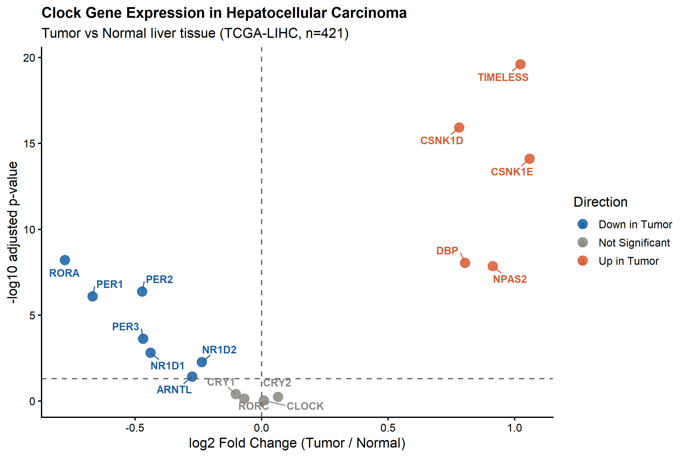
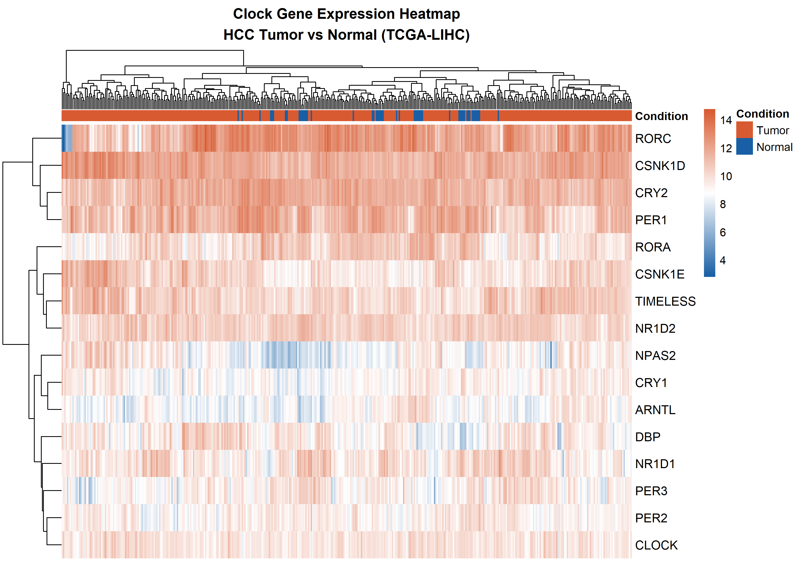
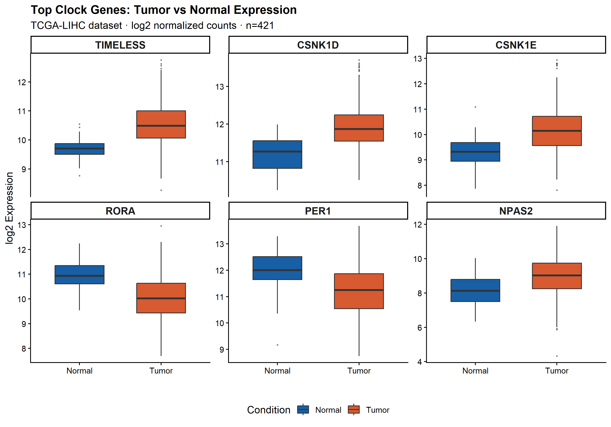

# Circadian Clock Gene Expression Analysis in Hepatocellular Carcinoma

**Author:** Abhishek Shandilya, B.Tech Computer Science and Engineering (2nd Year), VIT Bhopal University  
**Duration:** February 2026 – April 2026  
**Type:** Independent Research Project

---

## Overview

This project investigates which circadian clock genes are differentially expressed in liver cancer (hepatocellular carcinoma) compared to normal liver tissue, using RNA-seq data from real patient samples sourced from The Cancer Genome Atlas (TCGA).

The circadian clock is the internal 24-hour timing system that controls cell division, DNA repair, and metabolism. When this clock breaks in cancer cells, growth becomes uncontrolled. This analysis identifies exactly which clock genes are disrupted in liver cancer and in which direction.

---

## Dataset

| Parameter | Value |
|-----------|-------|
| Source | The Cancer Genome Atlas (TCGA) |
| Project | TCGA-LIHC (Liver Hepatocellular Carcinoma) |
| Data Type | RNA-seq gene expression (STAR - Counts) |
| Tumor Samples | 371 |
| Normal Liver Samples | 50 |
| Total Samples | 421 |
| Genes Analyzed | 16 circadian clock genes |

---

## Methods

- Data download and preparation: `TCGAbiolinks` R package
- Differential expression analysis: `DESeq2`
- Significance threshold: adjusted p-value < 0.05 (Benjamini-Hochberg correction)
- Visualization: `ggplot2`, `pheatmap`, `ggrepel`
- Language: R 4.5.3

---

## Results

12 of 16 clock genes (75%) are significantly disrupted in HCC.

**Upregulated in tumor (5 genes):**

| Gene | log2 Fold Change | Adjusted p-value |
|------|-----------------|-----------------|
| TIMELESS | +1.023 | 2.49e-20 |
| CSNK1E | +1.059 | 7.98e-15 |
| CSNK1D | +0.781 | 1.20e-16 |
| NPAS2 | +0.913 | 1.40e-08 |
| DBP | +0.804 | 9.18e-09 |

**Downregulated in tumor (7 genes):**

| Gene | log2 Fold Change | Adjusted p-value |
|------|-----------------|-----------------|
| RORA | -0.777 | 6.19e-09 |
| PER1 | -0.667 | 8.19e-07 |
| PER2 | -0.471 | 4.23e-07 |
| PER3 | -0.467 | 2.39e-04 |
| NR1D1 | -0.439 | 1.53e-03 |
| NR1D2 | -0.236 | 5.35e-03 |
| ARNTL | -0.274 | 3.79e-02 |

**Not significant:** CRY1, CRY2, RORC, CLOCK

---

## Figures

**Volcano Plot**

**Heatmap**

**Box Plots — Top 6 Genes**

---

## Interpretation

The data shows a two-directional collapse of the circadian clock in HCC. The tumor-suppressive components of the clock (PER1, PER2, PER3, RORA) are silenced while the pro-proliferative components (TIMELESS, CSNK1E, CSNK1D) are overactivated. TIMELESS, which controls DNA replication timing, is 2.03x higher in tumor tissue with an adjusted p-value of 2.49e-20 — the strongest signal in the dataset.

---

## Background

This project was inspired by a research problem listed in the SRIP (Summer Research Internship Program) at IIT Gandhinagar. I was not selected for the formal program but completed the analysis independently. All data is publicly available through TCGA. All code and analysis was written and executed independently.

---

## Reproducibility

All analysis was performed in R. Data is freely available at https://portal.gdc.cancer.gov under project TCGA-LIHC and can be downloaded using the TCGAbiolinks package.
